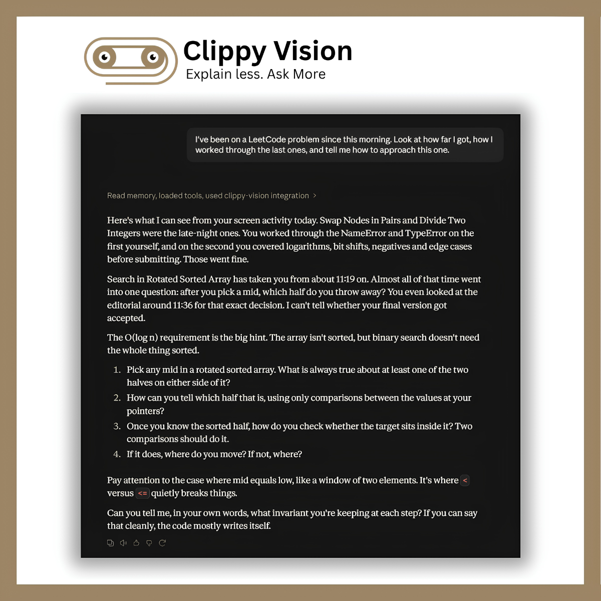
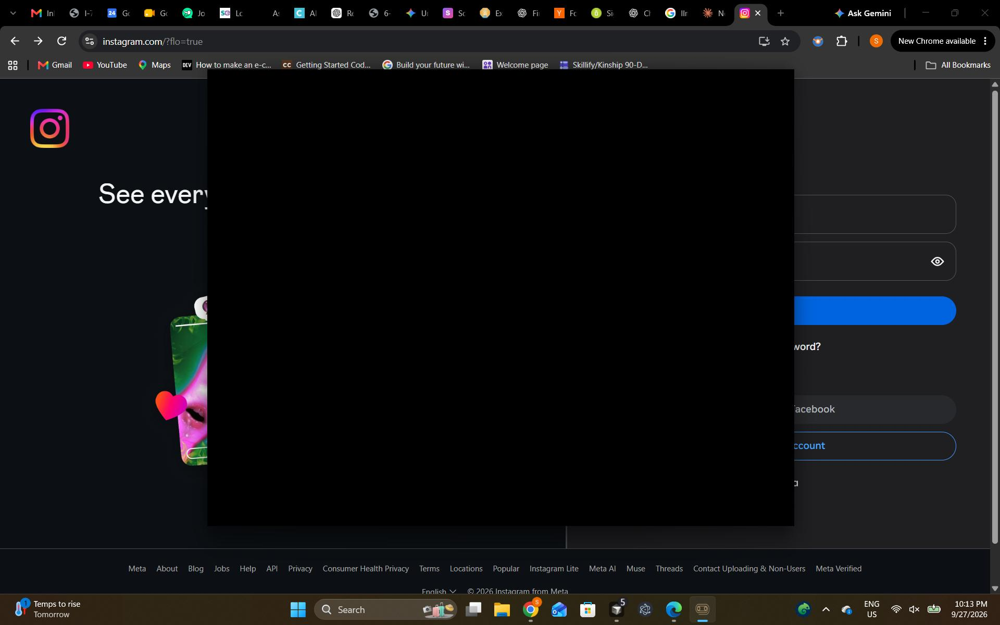

# Clippy Vision

Clippy Vision watches your work on this computer, stores a searchable activity history locally, and lets you ask about it through a connected MCP client such as Cursor, Claude Desktop, or VS Code. The desktop app captures, summarizes, and shows the timeline.

  

Ask in a connected MCP client, for example:

- "What was I working on before lunch?"
- "Which hotels did I look at yesterday?"
- "What was the error I encountered in my terminal?"

---

## Download

**Windows is tested for 2.0.** macOS validation is pending, so macOS 2.0 installers are not included yet. macOS downloads below are the previous release (**v1.3.1**). The README describes 2.0; some features differ from 1.3.1.

  

  
  &nbsp;
  

  <a href="https://github.com/protocorn/clippy-vision/releases/latest">All releases &amp; older versions</a>
  &nbsp;·&nbsp;
  
  &nbsp;
  

The installers are unsigned: on Windows choose **More info → Run anyway**, and on macOS right-click → **Open** the first time. First run needs internet for dependencies and for the chat model you pick in setup (for example `qwen3:8b` is ~4.7 GB).

**Trying Clippy?** [Share feedback (5 min)](https://docs.google.com/forms/d/e/1FAIpQLScqsgeWGLdUS_Ba0Me0LPQH8QRrwnIgGiGGHwLElVuqIpfcxQ/viewform).

### Requirements

| | Minimum | Recommended |
|--|---------|-------------|
| OS | Windows 10 / 11 (64-bit) or macOS 12+ | Windows 11 or a current macOS |
| System RAM | 8 GB | 16 GB |
| Graphics memory | Not required. Integrated graphics or Apple unified memory is enough | 4 GB+ dedicated on Windows, or 16 GB unified memory on Apple silicon |
| Free disk | 8 GB | 10 GB+ |

The setup wizard checks these numbers before installing. Below minimum → setup is blocked. Between minimum and recommended → you can continue with a warning that summaries may feel slower. Homebrew, dependency, and permission troubleshooting: [docs/usage.md](docs/usage.md#installation-troubleshooting). Lower-spec machines: [CONTRIBUTING.md](CONTRIBUTING.md#lower-spec-machines).

---

## Quick Start

1. Download and install Clippy.
2. Complete the setup wizard and grant required permissions.
3. Leave Clippy running to build your activity history.
4. Open **Settings → Connect apps**, connect your agent, and ask about your activity.

More detail: [docs/usage.md](docs/usage.md) · [docs/mcp.md](docs/mcp.md)  
Build from source: [CONTRIBUTING.md](CONTRIBUTING.md#building-from-source)

---

## Features

- Searchable activity history across apps
- Local summaries and long-term memory
- Access through MCP-compatible agents
- A timeline for reviewing and deleting activity
- Capture and privacy controls

---

## Privacy

- Clippy captures foreground windows, clipboard, typing metrics, and screenshots.
- Capture, summarization, and storage run locally on this computer.
- Connected cloud agents can receive retrieved memory through MCP tool replies.
- Connected clients have access to all exposed Clippy tools.
- Redaction is best effort. Private-browsing protection covers only Google Chrome, Microsoft Edge, and Brave.
- You can pause capture and delete stored activity from the tray or timeline.

Full guide (retention defaults and detailed behavior): [docs/usage.md](docs/usage.md#privacy-settings).

  

---

## Documentation & Roadmap

| Guide | Contents |
|-------|----------|
| [docs/usage.md](docs/usage.md) | Capture controls, privacy, accessibility, install troubleshooting |
| [docs/mcp.md](docs/mcp.md) | Supported clients, Copy JSON, tool reference, access permissions |
| [docs/architecture.md](docs/architecture.md) | Tech stack, capture pipeline, summarization, distillation, schema |
| [CONTRIBUTING.md](CONTRIBUTING.md) | Build from source and contribution guide |
| [PROJECT_VISION.md](PROJECT_VISION.md) | Roadmap, principles, and known limitations |

---

## Contributing

See [CONTRIBUTING.md](CONTRIBUTING.md) for setup steps, building from source, and good first issues.

---

## Contributors

Thanks to everyone who has shipped code, docs, design, or ideas.

<!-- CONTRIBUTORS-STATS:START -->

| | Contributor | What they built |
| :---: | :--- | :--- |
|  | <a href="https://github.com/protocorn"><b>@protocorn</b></a> 💻 📖 🎨 🤔 🚧 | Designed the core app: agent, vision pipeline, memory system, and the Electron desktop shell. |
|  | <a href="https://github.com/rusetiq"><b>@rusetiq</b></a> 💻 📦 | Brought Clippy Vision to macOS: native screen capture, permissions, and Apple Silicon + Intel packaging. |
|  | <a href="https://github.com/ABarpanda"><b>@ABarpanda</b></a> 💻 | <a href="https://github.com/protocorn/clippy-vision/commits?author=ABarpanda">See their commits →</a> |
|  | <a href="https://github.com/vitorparras"><b>@vitorparras</b></a> 💻 | <a href="https://github.com/protocorn/clippy-vision/commits?author=vitorparras">See their commits →</a> |
|  | <a href="https://github.com/vaishn4vi"><b>@vaishn4vi</b></a> 💻 | <a href="https://github.com/protocorn/clippy-vision/commits?author=vaishn4vi">See their commits →</a> |
|  | <a href="https://github.com/adity982"><b>@adity982</b></a> 💻 | <a href="https://github.com/protocorn/clippy-vision/commits?author=adity982">See their commits →</a> |
|  | <a href="https://github.com/Draoui-Haroun"><b>@Draoui-Haroun</b></a> 💻 | <a href="https://github.com/protocorn/clippy-vision/commits?author=Draoui-Haroun">See their commits →</a> |
|  | <a href="https://github.com/shaurya703"><b>@shaurya703</b></a> 💻 | <a href="https://github.com/protocorn/clippy-vision/commits?author=shaurya703">See their commits →</a> |
|  | <a href="https://github.com/cyforkk"><b>@cyforkk</b></a> 💻 | Made errors readable: replaced bare HTTP status codes with real API error messages in chat. |
|  | <a href="https://github.com/icn5381"><b>@icn5381</b></a> 💻 | <a href="https://github.com/protocorn/clippy-vision/commits?author=icn5381">See their commits →</a> |
<!-- CONTRIBUTORS-STATS:END -->

How to get on this wall: [CONTRIBUTING.md](CONTRIBUTING.md#contribution-types).

---

## License

AGPL-3.0. See [LICENSE](LICENSE). Releases already published through v1.3.1 stay under MIT. A commercial license for companies that cannot use AGPL is not written yet.
